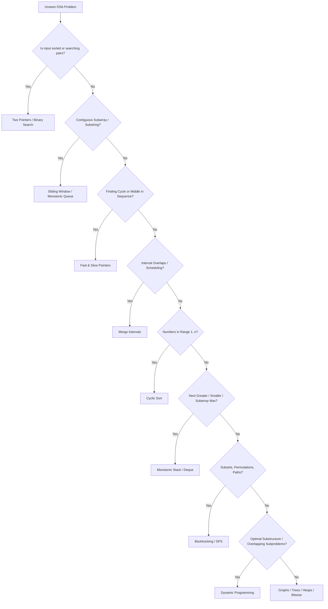

# 🚀 Master C++ Data Structures & Algorithms (DSA) Pattern Repository

Welcome to the ultimate, production-grade **DSA Pattern Mastery Guide in Modern C++**. This repository is meticulously engineered to take you from algorithmic fundamentals to advanced competitive programming and FAANG/Tier-1 interview mastery using structured, pattern-based thinking.

---

## 🧭 Why Pattern-Based Learning?

Instead of memorizing 2,000+ individual LeetCode problems, mastering **16 Core Algorithmic Patterns** allows you to instantly recognize underlying problem structures, choose optimal time/space complexity tradeoffs, and implement bug-free C++ solutions on the first attempt.



---

## 📚 Master Pattern Taxonomy & Curriculum (27+ Curated Problems per Pattern)

| # | Pattern Directory | Core Concepts & Sub-patterns | Theory Guide | Question Bank |
|---|---|---|:---:|:---:|
| **01** | [`01_two_pointers/`](./01_two_pointers/) | Converging (Opposite End), Parallel (Same Direction), 3-Pointer Partition, Multi-Pointer Target Search | [Theory Guide](./01_two_pointers/THEORY.md) | [27+ Problems](./01_two_pointers/README.md) |
| **02** | [`02_sliding_window/`](./02_sliding_window/) | Fixed Window, Variable/Dynamic Window, Hash Counter Tracking, Minimum Window Substring | [Theory Guide](./02_sliding_window/THEORY.md) | [27+ Problems](./02_sliding_window/README.md) |
| **03** | [`03_fast_and_slow_pointers/`](./03_fast_and_slow_pointers/) | Floyd's Tortoise & Hare, LinkedList Cycle & Start Node, Palindrome List, Circular Array Loop | [Theory Guide](./03_fast_and_slow_pointers/THEORY.md) | [27+ Problems](./03_fast_and_slow_pointers/README.md) |
| **04** | [`04_monotonic_stack_and_queue/`](./04_monotonic_stack_and_queue/) | Next/Previous Greater/Smaller Element, Largest Rectangle in Histogram, Sliding Window Maximum | [Theory Guide](./04_monotonic_stack_and_queue/THEORY.md) | [27+ Problems](./04_monotonic_stack_and_queue/README.md) |
| **05** | [`05_merge_intervals/`](./05_merge_intervals/) | Overlapping Intervals, Interval Intersection, Insert Interval, Meeting Rooms, Minimum Platforms | [Theory Guide](./05_merge_intervals/THEORY.md) | [27+ Problems](./05_merge_intervals/README.md) |
| **06** | [`06_cyclic_sort/`](./06_cyclic_sort/) | $O(N)$ In-place Value-to-Index Hashing, Missing Number, Find All Duplicates, First Missing Positive | [Theory Guide](./06_cyclic_sort/THEORY.md) | [27+ Problems](./06_cyclic_sort/README.md) |
| **07** | [`07_in_place_reversal_of_linked_list/`](./07_in_place_reversal_of_linked_list/) | Single-pass Iterative/Recursive Reversal, Sub-list Reversal, Reverse in K-Groups, Reorder List | [Theory Guide](./07_in_place_reversal_of_linked_list/THEORY.md) | [27+ Problems](./07_in_place_reversal_of_linked_list/README.md) |
| **08** | [`08_modified_binary_search/`](./08_modified_binary_search/) | Rotated Sorted Array, Peak Elements, Infinite Arrays, Binary Search on Answer Space / Predicate $f(x)$ | [Theory Guide](./08_modified_binary_search/THEORY.md) | [27+ Problems](./08_modified_binary_search/README.md) |
| **09** | [`09_tree_bfs_dfs_traversals/`](./09_tree_bfs_dfs_traversals/) | Level Order, Zigzag, Tree Diameter, Path Sum I-III, Lowest Common Ancestor (LCA), Binary Tree Cameras | [Theory Guide](./09_tree_bfs_dfs_traversals/THEORY.md) | [27+ Problems](./09_tree_bfs_dfs_traversals/README.md) |
| **10** | [`10_two_heaps_and_top_k/`](./10_two_heaps_and_top_k/) | Streaming Median (Min-Max Heap), Top K Frequent, Kth Largest, Merge K Sorted Lists, Task Scheduler | [Theory Guide](./10_two_heaps_and_top_k/THEORY.md) | [27+ Problems](./10_two_heaps_and_top_k/README.md) |
| **11** | [`11_subsets_and_backtracking/`](./11_subsets_and_backtracking/) | Cascading, Permutations, Combinations, N-Queens, Sudoku Solver, Word Search, Partitioning | [Theory Guide](./11_subsets_and_backtracking/THEORY.md) | [27+ Problems](./11_subsets_and_backtracking/README.md) |
| **12** | [`12_graph_algorithms/`](./12_graph_algorithms/) | BFS/DFS, Kahn's Topological Sort, Dijkstra, Disjoint Set Union (DSU), Kruskal/Prim MST, Bridges | [Theory Guide](./12_graph_algorithms/THEORY.md) | [27+ Problems](./12_graph_algorithms/README.md) |
| **13** | [`13_dynamic_programming/`](./13_dynamic_programming/) | 0/1 Knapsack, Unbounded Knapsack, LCS, LIS, Matrix DP, State Machine, Interval DP, Bitmask DP | [Theory Guide](./13_dynamic_programming/THEORY.md) | [27+ Problems](./13_dynamic_programming/README.md) |
| **14** | [`14_trie_and_strings/`](./14_trie_and_strings/) | Prefix Tree, Autocomplete, Bitwise XOR Trie, Maximum XOR Pair, KMP & Z-Algorithm | [Theory Guide](./14_trie_and_strings/THEORY.md) | [27+ Problems](./14_trie_and_strings/README.md) |
| **15** | [`15_bit_manipulation_and_math/`](./15_bit_manipulation_and_math/) | Bitwise Kernighan's, Subset Generation, Single Number I-III, Modular Exponentiation, Sieve | [Theory Guide](./15_bit_manipulation_and_math/THEORY.md) | [27+ Problems](./15_bit_manipulation_and_math/README.md) |
| **16** | [`16_segment_tree_and_fenwick/`](./16_segment_tree_and_fenwick/) | Point Update / Range Query, Range Update with Lazy Propagation, Fenwick Tree / BIT Inversions | [Theory Guide](./16_segment_tree_and_fenwick/THEORY.md) | [27+ Problems](./16_segment_tree_and_fenwick/README.md) |

---

## ⚡ Modern C++ STL Best Practices for DSA

Every implementation in this repository adheres to modern, competitive-grade C++ standards (C++17 / C++20):

```cpp
#include <iostream>
#include <vector>
#include <string>
#include <algorithm>
#include <unordered_map>
#include <unordered_set>
#include <queue>
#include <stack>
#include <cassert>

// Fast I/O for competitive programming
inline void fast_io() {
    std::ios_base::sync_with_stdio(false);
    std::cin.tie(NULL);
}

// Pass by const reference to avoid deep copies: const std::vector<int>&
// Use emplace_back() / emplace() for in-place construction
// Use structured bindings (C++17): auto [u, v, weight] = edge;
// Reserve memory when size is known: vec.reserve(n);
```

---

## 🛠️ How to Compile and Run Solutions

Each `.cpp` file is completely self-contained with multiple approaches and a built-in `main()` test harness.

```bash
# Compile any problem using C++17
g++ -std=c++17 -O2 -Wall 01_two_pointers/01_pair_with_target_sum.cpp -o solution

# Execute binary
./solution
```

All test cases and assertions will execute automatically and display verification results in your console.
